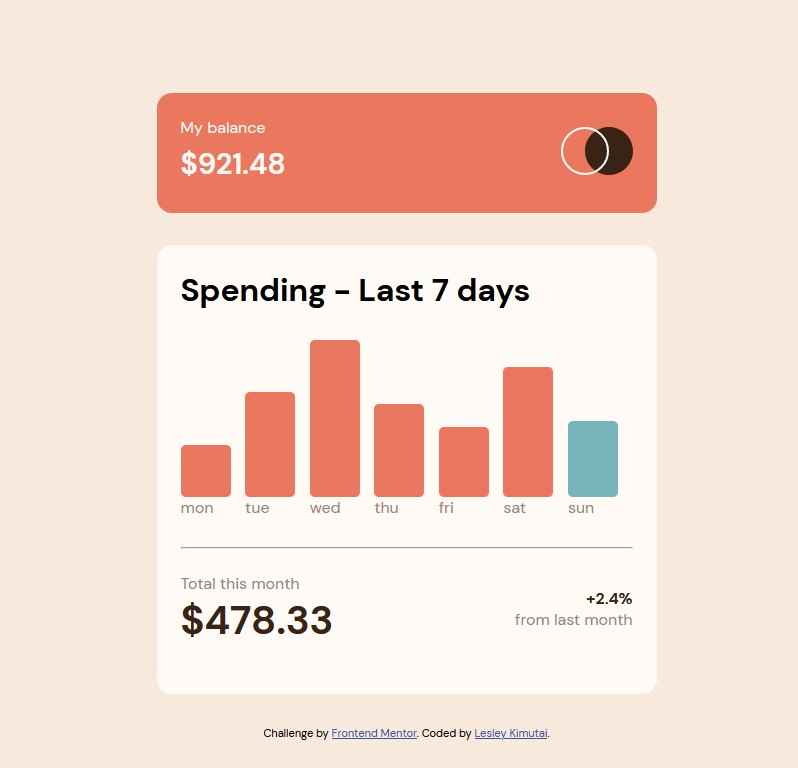

# Frontend Mentor - Expenses chart component solution

This is a solution to the [Expenses chart component challenge on Frontend Mentor](https://www.frontendmentor.io/challenges/expenses-chart-component-e7yJBUdjwt). Frontend Mentor challenges help you improve your coding skills by building realistic projects.

## Table of contents

- [Overview](#overview)
  - [The challenge](#the-challenge)
  - [Screenshot](#screenshot)
  - [Links](#links)
- [My process](#my-process)
  - [Built with](#built-with)
  - [What I learned](#what-i-learned)

## Overview

### The challenge

Users should be able to:

- View the bar chart and hover over the individual bars to see the correct amounts for each day
- See the current day’s bar highlighted in a different colour to the other bars
- View the optimal layout for the content depending on their device’s screen size
- See hover states for all interactive elements on the page
- **Bonus**: Use the JSON data file provided to dynamically size the bars on the chart

### Screenshot



### Links

- Solution URL: [Github Link](https://github.com/issagoodlifeInc/expense-chart.git)
- Live Site URL: [Live Site(Netlify)](https://expennse-chart.netlify.app/)

## My process

- Set up the app by for version control with git

- Initialized npm and instlled three packages necessary for react usage [react, react-dom, and react-scripts]

- Tweaked the `package.json` file so that it can be deployed and viewed -- tweaked react-scripts

```json
{
  // CI false ensures warnings are not deemed as errors when building
  "scripts": {
    "build": "CI false react-scripts build",
    "start": "react-scripts start"
  },
  // Linter code
  "eslintConfig": {
    "extends": ["react-app", "react-app/jest"]
  }
}
```

- Worked on markup first html the created the three components to be used and imported the to the App and imported `App` onn the `index.js` file

- Wrote this down before deciding on how to dynamically add in the datas from `data.json`

- Had a hard time using the `fetch` api so desiced to change the `data.json` to a js file and import the data to the `main` component

- Worked on the styling of the components to get as close to the design as possible

- Asked for help on the Frontend Mentor slack channel to get the amounts to pop up on hovering.

-

### Built with

- Semantic HTML5 markup
- CSS custom properties
- Flexbox
- CSS Grid
- Mobile-first workflow
- [React](https://reactjs.org/) - JS library

### What I learned

Trying to learn more on how to handle react and styling in react
